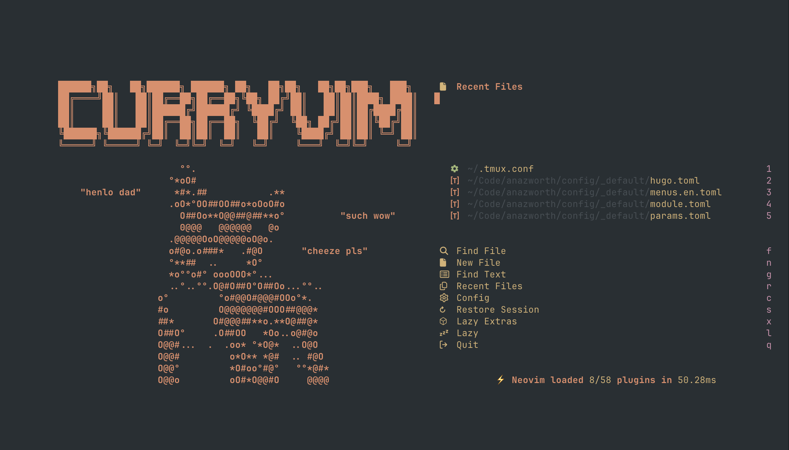

I often get asked about my tools and configuration by friends and colleagues.

I think it's pretty simple, but I understand it's outside the norm, so I thought it would be a good idea to document it here.

## Neovim

I pretty much exclusively use Neovim for writing code.

[My Neovim configuration](https://github.com/anazworth/Neovim-Curry) is actually very simple:

- [lazyvim](https://www.lazyvim.org/) - This gives me all of the creature comforts of LSP, file-grep, project-wide searching, etc. without having to maintain a mountain of plugins.
- Curry-themed dashboard
- [vim-test](https://github.com/vim-test/vim-test)
- [Everforest theme](https://github.com/neanias/everforest-nvim)
- Binding `kj` to `<esc>` to save my pinky finger

I started using Neovim as a challenge when I first tried [Advent of Code](https://adventofcode.com/). I was still very new to programming, and after about 3 days, I realized I was never going back to any other text editor.
The ability to quickly manipulate text without interrupting my train of thought is just too important to me. Vim is also installed by default on most server-environments, which makes my life easier.

## tmux

I _always_ use tmux when working in server-environments. I keep my personal tmux configuration as the defaults (minus _one little thing_) so that I can remain comfortable when I can't use my own dotfiles.

I typically use `tmux` when working on my own machine, but I sometimes just use my terminal's "tab" feature instead.

On my own machines I use `<ctl>a` as my leader key. In addition to saving my pinky/thumb, it prevents me from having to hit `<leader>` twice if I'm remoting in to another system.

## Lazygit

I love using [Lazygit](https://github.com/jesseduffield/lazygit). I'm really not a fan of using a GUI for Git, but Lazygit just gives me information so much faster than `git <...>`.

## k9s

Similar to Lazygit, [k9s](https://k9scli.io/) is a vim-centric TUI for managing Kubernetes clusters. It helps me get information and diagnose problems faster than I can use `kubectl`.

## tldr

I love man pages, `kubectl explain`, and [tldr](https://tealdeer-rs.github.io/tealdeer/). Being able to quickly learn (or remember) how to do something without having to leave the terminal is incredibly valuable to me.

## Obsidian

I use [Obsidian](https://obsidian.md/) for taking notes, making todo lists, and documenting meetings. I use my own twist on the [Johnny.Decimal](https://johnnydecimal.com/) organization system.
